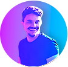

<h1 align="center">:file_cabinet: Pictura - Projeto</h1>

 

## :memo: Descrição
Projeto 100% original e completamente desenvolvido por mim! Desde da prototipação, até o design, textos, identidade visual e o front-end além do JavaScript.

## :wrench: Tecnologias utilizadas

## :handshake: Colaboradores
<table>
  <tr>
    <td align="center">
      <a href="http://github.com/Dukaah">
         
        
          <b>Dukaah</b>
        
      </a>
    </td>
  </tr>
</table>
